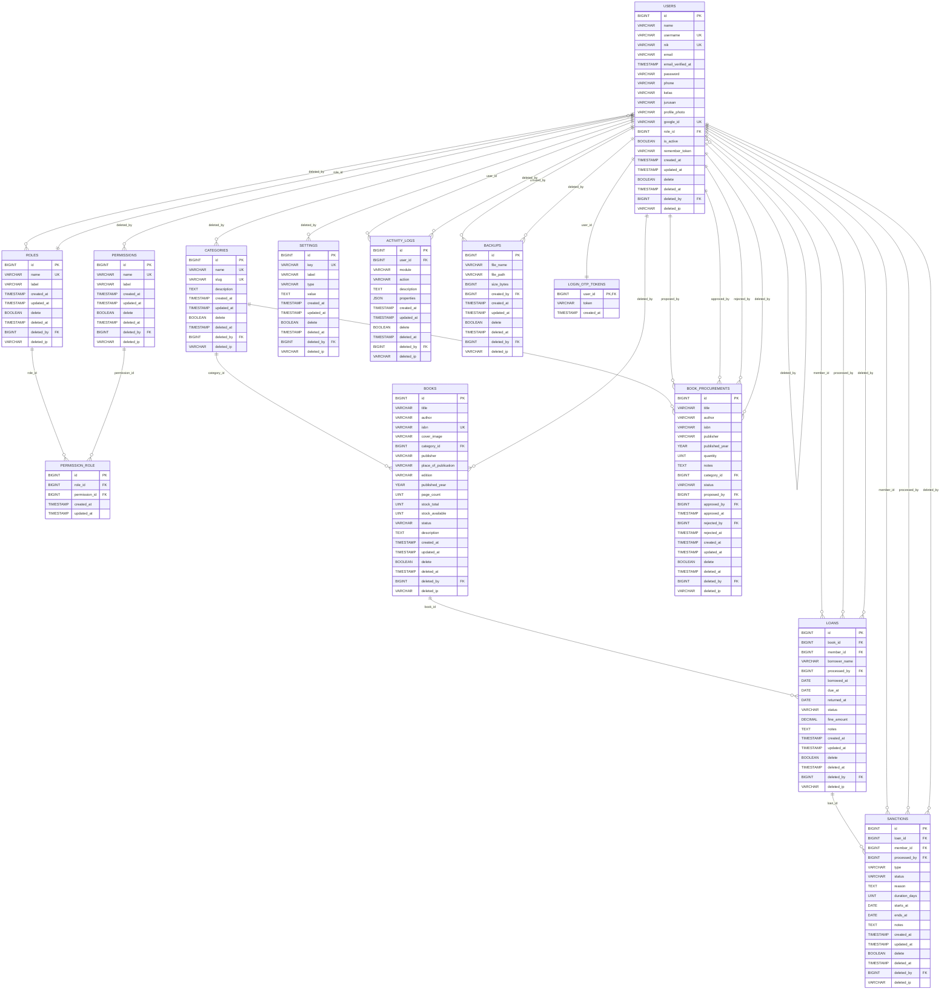

# ERD Print Perpustakaan Sekolah

Dokumen ini fokus ke tabel inti aplikasi perpustakaan agar lebih rapi saat digambar atau diprint, tetapi tetap mengikuti struktur database yang sudah termigrasi.

## Yang Sebaiknya Diprint

Untuk tugas sekolah, utamakan tabel inti berikut:

- `users`
- `roles`
- `permissions`
- `permission_role`
- `categories`
- `books`
- `loans`
- `sanctions`
- `book_procurements`
- `settings`
- `activity_logs`
- `backups`
- `login_otp_tokens`

Tabel bawaan Laravel seperti `cache`, `cache_locks`, `jobs`, `job_batches`, `failed_jobs`, `password_reset_tokens`, dan `sessions` bisa ditaruh kecil di samping atau tidak dijadikan fokus utama, kecuali guru meminta semua tabel.

## Simbol ERD

- `PK` = Primary Key
- `FK` = Foreign Key
- `UK` = Unique Key

## ERD Inti

## Relasi Yang Harus Benar Saat Digambar

- `users.role_id` -> `roles.id`
- `permission_role.role_id` -> `roles.id`
- `permission_role.permission_id` -> `permissions.id`
- `books.category_id` -> `categories.id`
- `loans.book_id` -> `books.id`
- `loans.member_id` -> `users.id`
- `loans.processed_by` -> `users.id`
- `sanctions.loan_id` -> `loans.id`
- `sanctions.member_id` -> `users.id`
- `sanctions.processed_by` -> `users.id`
- `book_procurements.category_id` -> `categories.id`
- `book_procurements.proposed_by` -> `users.id`
- `book_procurements.approved_by` -> `users.id`
- `book_procurements.rejected_by` -> `users.id`
- `activity_logs.user_id` -> `users.id`
- `backups.created_by` -> `users.id`
- `login_otp_tokens.user_id` -> `users.id`
- `deleted_by` di banyak tabel -> `users.id`

## Catatan Penting

- `users.email` saat ini tidak `unique` karena unique email sudah dihapus.
- `books.barcode` sudah tidak ada, karena migration penghapus barcode sudah dijalankan.
- `loans.member_id` sekarang boleh `null`.
- `sessions.user_id` hanya index, bukan foreign key.
- `login_otp_tokens.user_id` adalah `PK` sekaligus `FK`.
- Jika diagram terasa terlalu penuh, buat satu diagram utama untuk tabel inti perpustakaan lalu letakkan tabel Laravel bawaan di bagian kecil terpisah.
