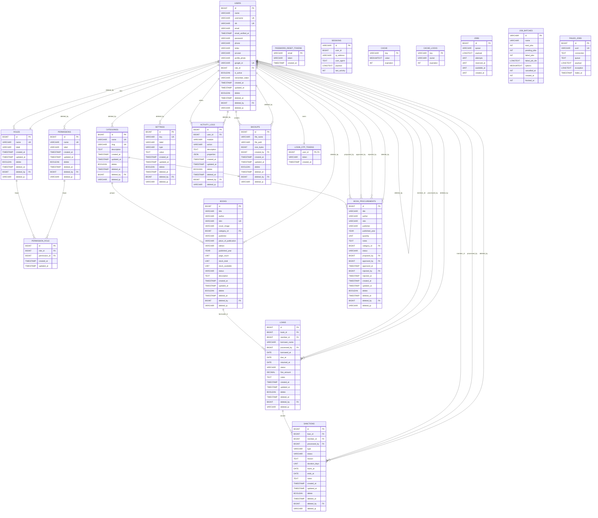

# ERD Perpustakaan Sekolah

ERD ini disusun langsung dari migrasi di folder `database/migrations`, jadi isinya mengikuti struktur database project saat ini.

## Keterangan Simbol

- `PK` = Primary Key
- `FK` = Foreign Key
- `UK` = Unique Key

## Mermaid ERD

## Catatan Penting

- `sessions.user_id` hanya `index`, bukan foreign key.
- `users.email` saat ini **tidak unique** karena unique email sudah dihapus pada migrasi `2026_04_09_140000_allow_duplicate_user_emails.php`.
- `books.barcode` **tidak masuk ERD** karena fitur barcode sudah dihapus pada migrasi `2026_04_18_000000_remove_scan_barcode_feature.php`.
- `loans.member_id` sekarang nullable, dan ada kolom tambahan `borrower_name`.
- `login_otp_tokens.user_id` adalah `PK` sekaligus `FK` ke `users.id`.
- Hampir semua tabel utama punya kolom audit soft delete:
  `delete`, `deleted_at`, `deleted_by`, `deleted_ip`.

## Relasi Inti Yang Biasanya Digambar Besar

- `roles.id` -> `users.role_id`
- `roles.id` -> `permission_role.role_id`
- `permissions.id` -> `permission_role.permission_id`
- `categories.id` -> `books.category_id`
- `books.id` -> `loans.book_id`
- `users.id` -> `loans.member_id`
- `users.id` -> `loans.processed_by`
- `loans.id` -> `sanctions.loan_id`
- `users.id` -> `sanctions.member_id`
- `users.id` -> `sanctions.processed_by`
- `categories.id` -> `book_procurements.category_id`
- `users.id` -> `book_procurements.proposed_by`
- `users.id` -> `book_procurements.approved_by`
- `users.id` -> `book_procurements.rejected_by`
- `users.id` -> `login_otp_tokens.user_id`

